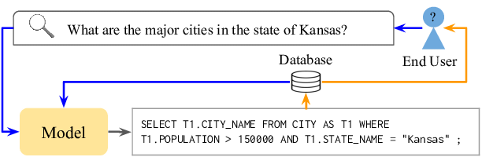
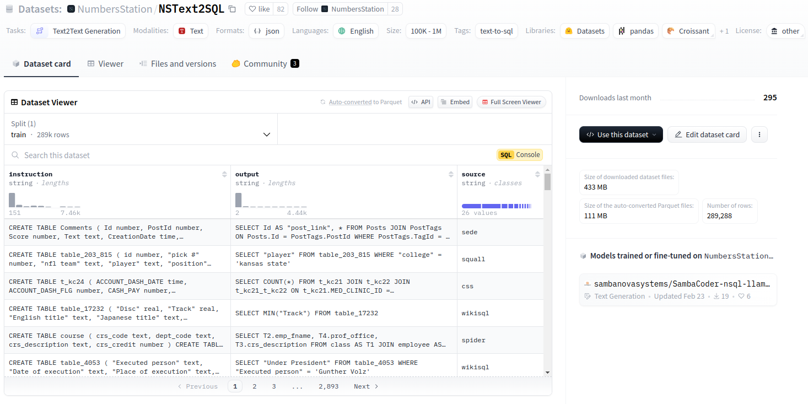
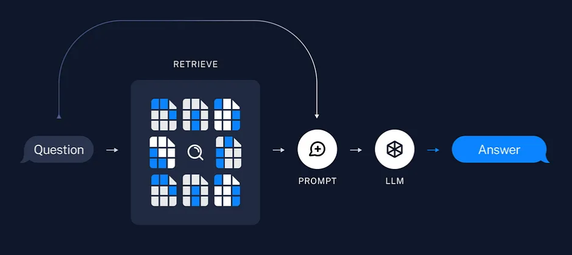
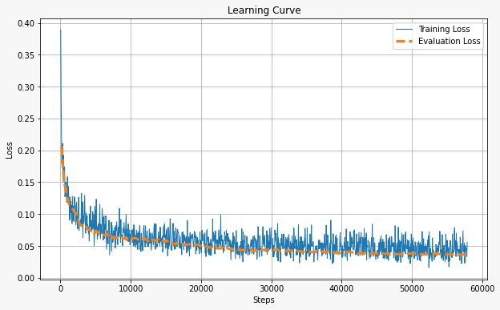
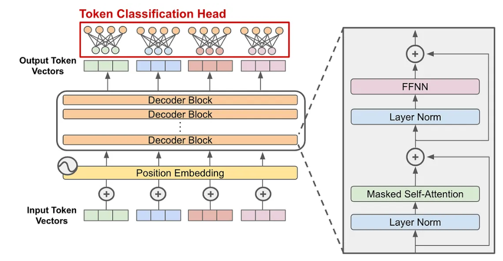
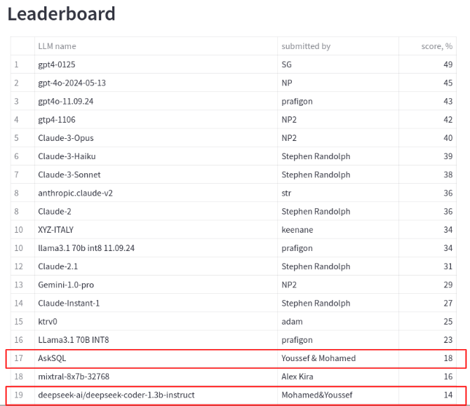

# AskSQL

## Text-to-SQL: Converting Natural Language Queries into SQL Statements

---

## Table of Contents
2. [Problem Statement](#problem-statement)  
3. [Dataset](#dataset)  
4. [Methods](#methods)  
5. [Conclusion](#conclusion)  
6. [Results](#results)  
7. [Input/Output Example](#inputoutput-example)  
8. [References](#references)  
9. [Progress](#progress)  

---

## Problem Statement
Given a natural language query (NLQ) on a Relational Database (RDB) with a specified schema, automatically generate a valid SQL query. It’s designed for non-technical users who need easy access to database queries without coding in SQL.

---

## Dataset
We used the **NSText2SQL** dataset, which combines text-to-SQL pairs from over 20 public sources. Steps included:
- Data Cleaning  
- Pre-processing  
- Table Schema Augmentation  
- SQL Cleaning  
- Instruction Generation (using existing LLMs)  

The final dataset has about **290,000** text-to-SQL samples.

---

## Methods

1. **QLoRA for Parameter-Efficient Fine-Tuning**  
   - **4-bit Quantization** to save memory and compute.  
   - **Double Quantization** (NF4) for better accuracy with small performance impact.  
   - **LoRA** to reduce overall parameters by focusing on essential layers.

2. **Retrieval-Augmented Generation (RAG)**  
   - Pulls relevant info from a knowledge store to improve the model's accuracy and relevance.

3. **Hyperparameter Tuning**  
   - Adjusted learning rate, epochs, batch size, `model_max_length`, etc., keeping hardware constraints in mind.

---

## Conclusion

1. **Hardware Constraints and Optimization**  
   Use techniques like QLoRA to reduce trainable parameters while keeping efficiency.

2. **Transfer Learning Benefits**  
   Saves time and usually yields strong performance.

3. **Enhanced Inference with Advanced Systems**  
   RAG can significantly boost inference results.

4. **Effective Learning from Limited Data**  
   Even with fewer samples, deep learning can still perform well with the right strategy.

5. **Insights from Diverse Benchmarks**  
   Each benchmark highlights different strengths and weaknesses. Use them all for a well-rounded evaluation.

---

## Base Model

**Deepseek-coder-1.3b-instruct**  
This model is based on the **DeepSeek Large Language Model (LLM)** framework (decoder-only Transformer).

---

## Live Demo
<video width="320" height="240" controls>
  <source src="https://github.com/MohamedRagabAbbas/AskSQL/blob/main/live_demo.mp4" type="video/mp4">
  Your browser does not support the video tag.
</video>

---

## References

- **Benchmark URL**: [LLM SQL Streamlit App](#)  
- **Model URL**: [Model Deepseek](#)  
- **Dataset URL**: [NumbersStation/NSText2SQL](#)

---

## Progress

This section shows the score progression over different training phases compared to a baseline model on the Text-2-SQL benchmark.

